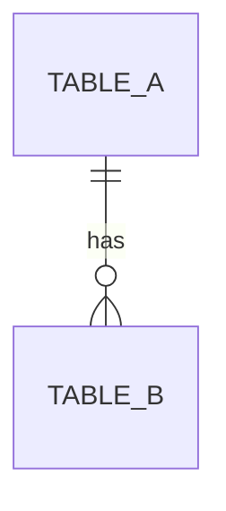

# Shared Artifacts Repository

This document defines the centralized artifact system shared across all skills. All skills MUST reference this document for artifact locations, naming conventions, and templates.

---

## Artifact Storage Structure

```
project-root/
├── docs/
│   ├── requirements/           # Business Analysis outputs
│   │   ├── user-stories.md     # US-xxx definitions
│   │   ├── functional-requirements.md    # FR-xxx specifications
│   │   ├── non-functional-requirements.md # NFR-xxx specifications
│   │   └── field-specifications.md       # Input/Output field specs
│   │
│   ├── test-design/            # Software Tester Design outputs
│   │   ├── sut-definition.md   # System Under Test
│   │   ├── test-scenarios.md   # SC-xxx definitions
│   │   ├── test-cases.md       # TC-xxx specifications
│   │   └── test-data.md        # Test data catalogue
│   │
│   ├── project/                # Project Management outputs
│   │   ├── backlog.md          # Epic and Story backlog
│   │   ├── iterations/         # Iteration cards
│   │   │   ├── iteration-1.md
│   │   │   └── iteration-N.md
│   │   ├── traceability-matrix.md  # US → FR → DEV → TC mapping
│   │   └── release-notes.md    # Release notes and changelog
│   │
│   ├── architecture/           # Software Architecture outputs
│   │   ├── api-contracts.md    # API endpoint specifications
│   │   ├── database-schema.md  # DB tables, columns, indexes
│   │   ├── integration-contracts.md  # External service contracts
│   │   ├── adrs/               # Architecture Decision Records
│   │   │   └── ADR-001-*.md
│   │   └── openapi/            # OpenAPI specifications
│   │       └── [feature]-api.yaml
│   │
│   └── user-guide/             # Technical Writer outputs
│       ├── getting-started.md
│       ├── tutorials/
│       ├── faq.md
│       └── troubleshooting.md
│
└── tests/                      # Test implementation (AI Orchestrator)
    ├── unit/
    ├── integration/
    └── e2e/
```

---

## Artifact ID Conventions

| Artifact Type | ID Format | Example | Produced By |
|---------------|-----------|---------|-------------|
| User Story | `US-[FEATURE]-###` | US-AUTH-001 | business-analysis |
| Functional Requirement | `FR-[FEATURE]-###` | FR-AUTH-001 | business-analysis |
| Non-Functional Requirement | `NFR-[FEATURE]-###` | NFR-AUTH-001 | business-analysis |
| Test Scenario | `SC-[FEATURE]-###` | SC-AUTH-001 | software-tester-design |
| Test Case | `TC-[FEATURE]-###` | TC-AUTH-001 | software-tester-design |
| Developer Task | `DEV-[FEATURE]-###` | DEV-AUTH-001 | project-management |
| Epic | `EPIC-[FEATURE]-###` | EPIC-AUTH-001 | project-management |
| Architecture Decision | `ADR-###` | ADR-001 | software-architecture |

**Feature codes** should be short, uppercase identifiers:
- AUTH = Authentication
- REG = Registration
- PAY = Payment
- DASH = Dashboard
- (define as needed per project)

---

## Artifact Templates

### US - User Story Template

```markdown
## US-[FEATURE]-### — [Story Title]

**As a** [role]
**I want** [capability]
**So that** [benefit]

### Acceptance Criteria
- [ ] AC-1: [criterion]
- [ ] AC-2: [criterion]

### Business Conditions
- BC-1: [condition]
- BC-2: [condition]

### Dependencies
- Depends on: [US-xxx, FR-xxx if any]

### Priority
[P1 / P2 / P3]
```

---

### FR - Functional Requirement Template

```markdown
## FR-[FEATURE]-### — [Requirement Title]

**Traces to:** US-[FEATURE]-###

### Description
[Observable behavior that the system MUST exhibit]

### Input
| Field | Type | Constraints | Required |
|-------|------|-------------|----------|
| field_name | string | max 100 chars | Yes |

### Output
| Field | Type | Description |
|-------|------|-------------|
| result | object | [description] |

### Business Rules
1. [Rule 1]
2. [Rule 2]

### Error Conditions
| Condition | Response |
|-----------|----------|
| Invalid input | 400 Bad Request |
```

---

### NFR - Non-Functional Requirement Template

```markdown
## NFR-[FEATURE]-### — [Requirement Title]

**Category:** [Performance | Security | Scalability | Usability | Reliability | Maintainability]

**Traces to:** US-[FEATURE]-###

### Requirement
[Measurable quality attribute]

### Acceptance Threshold
- [Metric]: [threshold value]
- Example: Response time < 200ms for 95th percentile

### Verification Method
[How this will be tested/measured]
```

---

### SC - Test Scenario Template

```markdown
## SC-[FEATURE]-### — [Scenario Title]

**Traces to:** US-[FEATURE]-###, FR-[FEATURE]-###

### Description
[High-level description of WHAT to test, not HOW]

### Preconditions
- [Precondition 1]
- [Precondition 2]

### Test Cases
| TC-ID | Summary | Priority |
|-------|---------|----------|
| TC-[FEATURE]-### | [brief summary] | P1 |

### Coverage
- Happy path: Yes/No
- Edge cases: [list]
- Error cases: [list]
```

---

### TC - Test Case Template

```markdown
## TC-[FEATURE]-### — [Test Case Title]

**Traces to:** SC-[FEATURE]-###, FR-[FEATURE]-###

### Test Attributes
| Attribute | Value |
|-----------|-------|
| Priority | P1 / P2 / P3 |
| Type | Unit / Integration / E2E |
| Technique | Equivalence Partitioning / Boundary Value / etc. |
| Automation | Automated / Manual |

### Preconditions
- [State or setup required before test]

### Test Data
| Variable | Value | Purpose |
|----------|-------|---------|
| input_1 | "value" | [why this value] |

### Steps
1. [Action 1]
2. [Action 2]
3. [Action 3]

### Expected Result
- [Expected outcome 1]
- [Expected outcome 2]

### Cleanup
- [Post-test cleanup if needed]
```

---

### DEV - Developer Task Template

```markdown
## DEV-[FEATURE]-### — [Task Title]

**Traces to:** TC-[FEATURE]-###, FR-[FEATURE]-###

### Layer
[Database | API | Frontend | Integration | Infrastructure]

### Description
[What needs to be implemented]

### Definition of Done
- [ ] TC-[FEATURE]-### passes
- [ ] Code review approved
- [ ] Documentation updated

### Dependencies
- Blocked by: [DEV-xxx if any]
- Blocks: [DEV-xxx if any]

### Estimated Complexity
[S / M / L / XL]
```

---

### Test Data Catalogue Template

```markdown
## Test Data Catalogue — [Feature Name]

### Valid Data Sets

| ID | Description | Data |
|----|-------------|------|
| TD-VALID-001 | Standard valid input | `{ "field": "value" }` |
| TD-VALID-002 | Boundary minimum | `{ "field": "a" }` |

### Invalid Data Sets

| ID | Description | Data | Expected Error |
|----|-------------|------|----------------|
| TD-INVALID-001 | Empty required field | `{ "field": "" }` | 400 - Field required |
| TD-INVALID-002 | Exceeds max length | `{ "field": "a"*101 }` | 400 - Too long |

### Edge Case Data Sets

| ID | Description | Data | Expected Behavior |
|----|-------------|------|-------------------|
| TD-EDGE-001 | Unicode characters | `{ "field": "日本語" }` | Accepted |
```

---

### Database Schema Template

```markdown
## Database Schema — [Feature Name]

**Traces to:** FR-[FEATURE]-###, DEV-[FEATURE]-###

### Tables

#### [table_name]

| Column | Type | Constraints | Description |
|--------|------|-------------|-------------|
| id | UUID | PK | Primary key |
| created_at | TIMESTAMP | NOT NULL, DEFAULT NOW() | Creation timestamp |
| updated_at | TIMESTAMP | NOT NULL | Last update timestamp |
| [column] | [type] | [constraints] | [description] |

### Indexes

| Index Name | Table | Columns | Type |
|------------|-------|---------|------|
| idx_[name] | [table] | [columns] | BTREE / GIN / etc. |

### Relationships



### Migrations
- Migration file: `migrations/[timestamp]_[description].sql`
```

---

### API Contract Template

```markdown
## API Contract — [Feature Name]

**Traces to:** FR-[FEATURE]-###, TC-[FEATURE]-###

### Endpoint

| Method | Path | Description |
|--------|------|-------------|
| POST | /api/v1/[resource] | [description] |

### Request

**Headers**
| Header | Required | Description |
|--------|----------|-------------|
| Authorization | Yes | Bearer token |
| Content-Type | Yes | application/json |

**Body**
```json
{
  "field": "string (required, max 100 chars)"
}
```

### Response

**Success (200/201)**
```json
{
  "data": {
    "id": "uuid",
    "field": "string"
  }
}
```

**Error (4xx/5xx)**
```json
{
  "error": {
    "code": "ERROR_CODE",
    "message": "Human readable message"
  }
}
```

### Validation Rules
| Field | Rule | Error Code |
|-------|------|------------|
| field | Required, max 100 chars | INVALID_FIELD |
```

---

### Architecture Decision Record (ADR) Template

```markdown
# ADR-### — [Decision Title]

**Date:** YYYY-MM-DD
**Status:** Proposed | Accepted | Deprecated | Superseded

## Context
[What is the issue or decision that needs to be made?]

## Decision
[What was decided and why?]

## Consequences
### Positive
- [benefit 1]
- [benefit 2]

### Negative
- [trade-off 1]
- [trade-off 2]

## Alternatives Considered
1. [Alternative 1] — rejected because [reason]
2. [Alternative 2] — rejected because [reason]
```

---

## Traceability Matrix Template

```markdown
## Traceability Matrix — [Feature Name]

| User Story | Functional Req | Developer Task | Test Case | Status |
|------------|----------------|----------------|-----------|--------|
| US-[F]-001 | FR-[F]-001 | DEV-[F]-001 | TC-[F]-001 | Pending |
| US-[F]-001 | FR-[F]-002 | DEV-[F]-002 | TC-[F]-002 | In Progress |
| US-[F]-002 | FR-[F]-003 | DEV-[F]-003 | TC-[F]-003 | Complete |

### Coverage Summary
- Total User Stories: X
- Total Test Cases: Y
- Coverage: Z%
```

---

## Artifact Lifecycle

```
┌─────────────────┐
│ business-analysis │
│   CREATES:      │
│   - US-xxx      │
│   - FR-xxx      │
│   - NFR-xxx     │
└────────┬────────┘
         │ READS US/FR/NFR
         ▼
┌─────────────────┐
│ software-tester │
│   CREATES:      │
│   - SC-xxx      │
│   - TC-xxx      │
│   - Test Data   │
└────────┬────────┘
         │ READS ALL ABOVE
         ▼
┌─────────────────┐
│ project-mgmt    │
│   CREATES:      │
│   - DEV-xxx     │
│   - Iterations  │
│   - Traceability│
└────────┬────────┘
         │ READS ITERATION SCOPE
         ▼
┌─────────────────┐
│ software-arch   │
│   CREATES:      │
│   - API Contract│
│   - DB Schema   │
│   - ADRs        │
│   - OpenAPI     │
└────────┬────────┘
         │ READS ARCH + TC
         ▼
┌─────────────────┐
│ ai-orchestrator │
│   CREATES:      │
│   - Test Code   │
│   - Impl Code   │
│   - Migrations  │
└────────┬────────┘
         │ READS SC/TC
         ▼
┌─────────────────┐
│ technical-writer│
│   CREATES:      │
│   - User Docs   │
│   - Tutorials   │
│   - FAQ         │
└─────────────────┘
```

---

## How Skills Should Reference This Document

All skills MUST include this directive in their workflow:

```markdown
### Artifact Reference
All artifacts MUST be stored in locations defined in `.opencode/artifacts/ARTIFACTS.md`.
Use the templates and naming conventions specified there.
```

---

## Quick Reference Card

| When you need... | Look in... | Template Section |
|------------------|------------|------------------|
| User requirements | `docs/requirements/user-stories.md` | US Template |
| What system must do | `docs/requirements/functional-requirements.md` | FR Template |
| Quality attributes | `docs/requirements/non-functional-requirements.md` | NFR Template |
| What to test | `docs/test-design/test-scenarios.md` | SC Template |
| How to test | `docs/test-design/test-cases.md` | TC Template |
| Test inputs | `docs/test-design/test-data.md` | Test Data Template |
| Task breakdown | `docs/project/backlog.md` | DEV Template |
| Current sprint | `docs/project/iterations/iteration-N.md` | Iteration Card |
| API specs | `docs/architecture/api-contracts.md` | API Template |
| DB design | `docs/architecture/database-schema.md` | DB Template |
| Design decisions | `docs/architecture/adrs/` | ADR Template |
| End-to-end tracing | `docs/project/traceability-matrix.md` | Traceability Template |
